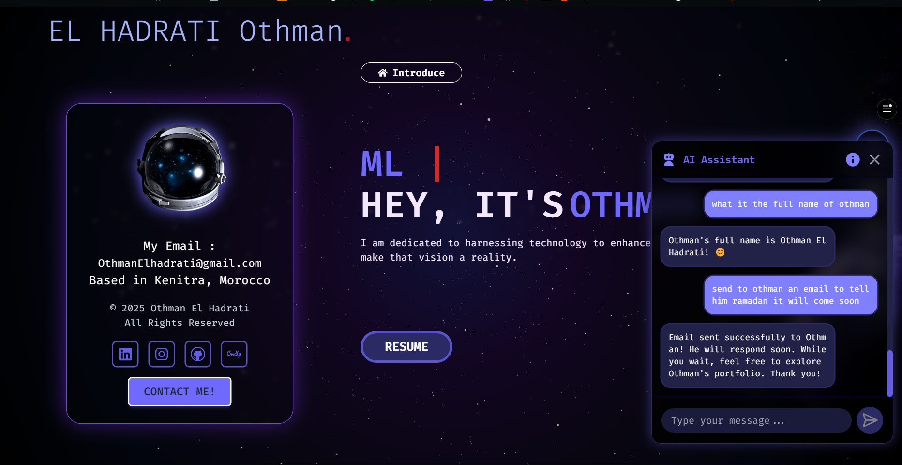
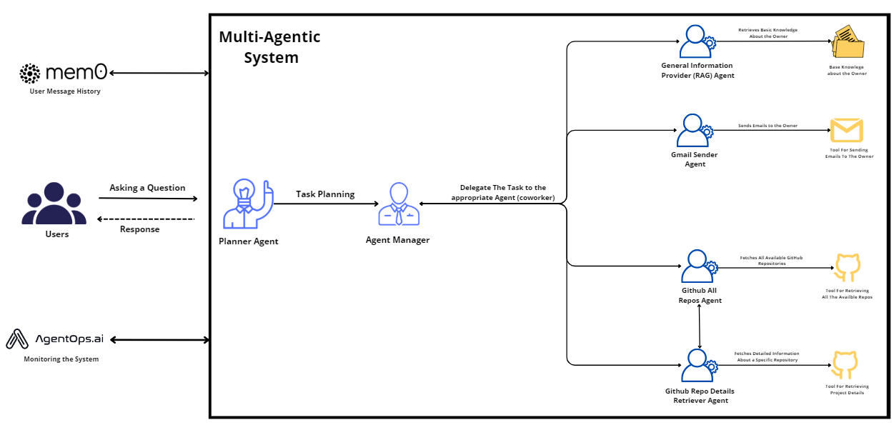

# Portfolio Chatbot API

A sophisticated AI-powered chatbot API designed to enhance my portfolio website by providing interactive responses about my projects, skills, and professional background. Built with **FastAPI** and **CrewAI**, it ensures intelligent and context-aware conversations.

## Overview

This chatbot leverages multiple specialized AI agents to deliver comprehensive responses while maintaining conversation history and offering personalized interactions through advanced memory management.

## UI



##  Architecture 




## Key Features

###  Multi-Agent Architecture
- **General Information Agent (RAG)**: Provides personal details and background.
- **Repository Agent**: Retrieves GitHub project information.
- **About Repository Agent**: Offers detailed insights into specific projects.
- **Agent Manager**: Coordinates responses between different agents.
- **Agent Gmail Sender**: Sends emails based on user requests.

###  Smart Memory Management
- Preserves conversation context.
- Maintains user interaction history.
- Generates personalized responses.

###  Robust & Secure API Design
- Built with **FastAPI** for high performance.
- **CORS protection** to prevent unauthorized access.
- Secure **session management** using cookies for better chatbot memory.

###  Email Integration
- **Gmail API** for automated email communications.
- Secure email-sending capabilities.
- Template-based email formatting.

## Tech Stack

| Component           | Technology Used  |
|--------------------|-----------------|
| **Backend Framework** | FastAPI         |
| **AI Framework**     | CrewAI          |
| **Embedding Model**  | Google Text Embedding |
| **Memory Storage**   | Mem0            |
| **Programming Language** | Python 3.x   |
| **Email Service**   | SMTP             |
| **Version Control** | GitHub API       |

## Setup

### 1️ Environment Variables
Create a `.env` file and configure the following keys:
```ini
GITHUB_TOKEN=""
GOOGLE_API_KEY=""
MEM0_API_KEY=""
AGENTOPS_API_KEY=""
GMAIL_APP_PASSWORD=""
```

### 2️ Installation
```bash
pip install -r requirements.txt
```

### 3️ Run the API
```bash
uvicorn api:app --host 0.0.0.0 --port 8000
```

## API Endpoints

| Method | Endpoint | Description |
|--------|---------|-------------|
| `GET`  | `/health` | Health check endpoint (returns API status). |
| `POST` | `/chat` | Main chat interaction endpoint (accepts user input and returns AI responses). |
| `GET`  | `/chat/history/{user_id}` | Retrieves chat history for a specific user. |

## Project Structure

```
PortfolioChatbot/
├── api.py                # Main FastAPI application and endpoints
├── .env.sample           # Sample environment variables template
├── requirements.txt      # Project dependencies
│
├── utils/                # Core utility modules
│   ├── agents.py        # AI agent definitions and configurations
│   ├── tasks.py         # Task management and orchestration
│   ├── tools.py         # Utility functions and helper tools
│   ├── base_models.py   # Pydantic data models
│   ├── knowledge.py     # Knowledge base management
│   └── model.py         # AI model configurations
│
├── knowledge/           # Knowledge base storage
│   ├── My_RESUME.pdf    # Resume storage
│   └── general_data/    # Portfolio-related knowledge
│
├── tests/               # Test suite
│
└── logs/                # Application logs
```

##  Architecture Overview

### **1️ API Layer (`api.py`)**
- FastAPI application setup.
- Endpoint definitions.
- CORS middleware integration.
- Request/Response handling.

### **2️ Agent System (`utils/agents.py`)**
- **General Information Agent (RAG)**: Handles personal and background info.
- **Repository Agent**: Fetches GitHub project data.
- **About Repository Agent**: Provides detailed insights into projects.
- **Agent Manager**: Orchestrates agent interactions.
- **Agent Gmail Sender**: Handles email-sending capabilities.

### **3️ Task Management (`utils/tasks.py`)**
- Task definition & execution.
- Assigns tasks to different agents.
- Processes and formats responses.

### **4️ Data Models (`utils/base_models.py`)**
- `Repository`: Represents GitHub repository structure.
- `ChatRequest`: Defines incoming chat messages.
- `ChatResponse`: Defines AI-generated responses.
- `CrewResponse`: Defines structured agent responses.

### **5️ Knowledge Management (`utils/knowledge.py`)**
- Stores structured portfolio information.
- Organizes knowledge base.
- Includes resume data.

### **6️ Tools & Utilities (`utils/tools.py`)**
- GitHub API integration.
- Gmail integration.
- Functions for retrieving repositories and content.

## 🔗 Integration Points

- **Frontend**: Integrated with my portfolio website → [0thman.tech](https://www.0thman.tech)
- **External Services**:
  - **GitHub API** → Retrieves repository data.
  - **Mem0** → Handles chatbot memory.
  - **Gemini API** → AI response generation.
  - **AgentOps API** → Monitoring the System.

##  Security

- **CORS Protection**: Restricted to my portfolio domain.
- **Secure API Key Management**: Secrets stored in `.env`.
- **Request Validation**: Prevents malicious inputs.

##  Contributing

If you encounter any bugs or have ideas for improvements, feel free to **open an issue** or **submit a pull request**! 

